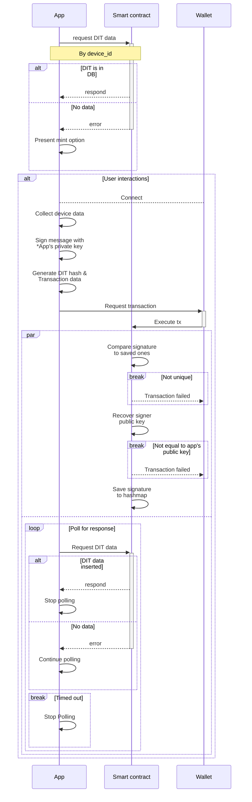
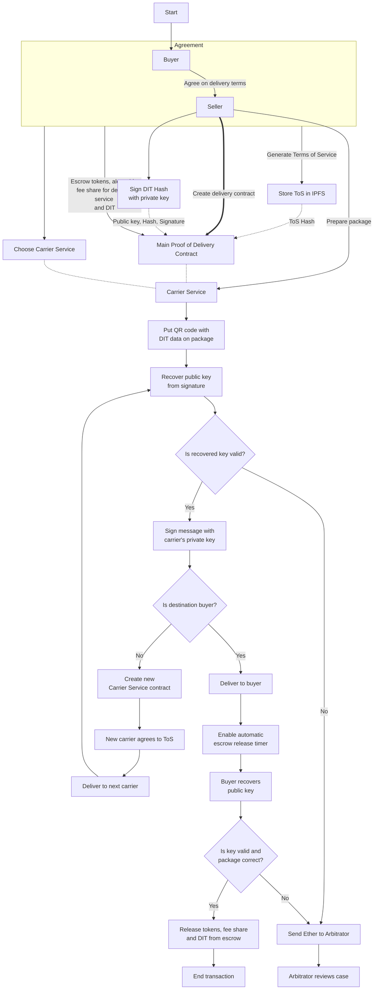

# Device Identity Token

The Device Identity Token (DIT) project leverages blockchain technology to create unique, non-transferable tokens tied to individual physical devices. These tokens enable secure verification of device ownership, prevent Sybil attacks, and ensure reliable transactions in device marketplaces, extending the capabilities of Proof of Delivery (PoD) technology.

> [!NOTE]
> This project is in early prototype stage, with many features still in development. Consider this a conceptual demonstration.

## Table of Contents

1.  [Project Overview](#project-overview)
2.  [Motivation](#motivation)
3.  [Key Features](#key-features)
4.  [Technical Implementation](#technical-implementation)
5.  [Use Cases](#use-cases)
6.  [Technologies Used](#technologies-used)
7.  [Getting Started](#getting-started)
8.  [Future Considerations](#future-considerations)
9. [Contribution](#contribution)

## Motivation

The project was conceived in April 2024, inspired by the Chainlink yearly hackathon and a growing interest in blockchain technologies. While initially planned as a hackathon entry, it evolved into a passion project to explore the potential of blockchain in solving real-world trust issues in digital marketplaces.

## Key Features

-   Unique, non-transferable tokens tied to physical devices
-   Blockchain-based verification of device ownership
-   Integration with Proof of Delivery (PoD) systems
-   Enhanced security for device marketplaces
-   Anti-Sybil measures for web3 applications
-   Secure, app-based token minting and management
-   Escrow functionality for secure transactions

## Technical Implementation

### Smart Contract Interaction Flow

The core of the DIT system involves interactions between the app, wallet, and smart contracts. Here's a simplified flow:

This flow ensures that each DIT is uniquely tied to a physical device and that all modifications are authenticated and traceable.

### Non-Transferability and Escrow

DITs are designed to be non-transferable, similar to Soulbound Tokens (SBTs), with a crucial exception:

1.  **Wallet Binding**: Each DIT is tightly bound to the wallet that minted it, representing true device ownership.
2.  **Escrow Exception**: DITs can be temporarily transferred to an official escrow smart contract during transactions. This ensures secure handoffs while maintaining the integrity of ownership records.
3.  **New Wallet for Sales**: Before selling a device, the owner must mint a new DIT on a fresh, empty wallet (e.g., on the device itself). This practice prevents unintended access to the seller's personal wallet.

This approach ensures that DITs accurately represent current device ownership while enabling secure transactions.

### Integration with Proof of Delivery (PoD)

The DIT system enhances traditional PoD processes by incorporating device-specific verification:

This integration creates a tamper-evident chain of custody, enhancing trust and security in device transactions.

## App Usage and Security

### Core Functionality

The DIT app serves as the primary interface for users to interact with the DIT ecosystem. Its main functions include:

1.  **Minting**: Create a new DIT for a device
2.  **Updating**: Modify DIT information (e.g., ownership transfer)
3.  **Burning**: Permanently destroy a DIT

### Security Measures

To ensure the integrity of DITs and prevent unauthorized modifications, the app implements several security measures:

1.  **Private Key Signing**: The app holds a private key used to sign all transaction requests. This signature is verified on-chain to ensure requests come from the official app.
2.  **Public Key Recovery**: The smart contract recovers the public key from each signature and compares it to the stored official app public key.
3.  **Unique Signature Verification**: Each transaction must have a unique signature to prevent replay attacks. The smart contract maintains a record of used signatures.
4.  **Device Data Collection**: The app collects specific device data to create a unique fingerprint, ensuring the DIT is tied to a real, physical device.

### Usage Process

1.  **Device Scanning**: The app scans the device to collect unique identifiers.
2.  **Data Hashing**: Collected data is hashed to create a unique DIT identifier.
3.  **Transaction Creation**: The app prepares a transaction with the DIT data and a unique message.
4.  **Signing**: The message is signed with the app's private key.
5.  **Blockchain Interaction**: The signed transaction is sent to the blockchain for processing.
6.  **Verification**: The smart contract verifies the signature and processes the request.
7. **Escrow (for transactions)**: In sale scenarios, the DIT is transferred to the escrow contract until the transaction is complete.

This process ensures that only authorized devices can mint or modify DITs, maintaining the integrity of the ecosystem.

## Use Cases

1.  **Decentralized Marketplace Enhancement**
    -   Secure device ownership verification
    -   Tamper-evident delivery process
    -   Automated escrow release
2.  **Anti-Sybil Measures**
    -   Account creation verification
    -   Participation in token distributions
    -   Access control for web3 applications
3.  **Supply Chain Verification**
    -   Tracking device provenance
    -   Preventing counterfeit devices
    -   Streamlining warranty and repair processes
4.  **Secure Device Rentals**
    -   Temporary DIT transfers for rental periods
    -   Automated access control for rented devices
    -   Seamless return process at the end of rental periods
5.  **Server Access Management**
    -   DIT-based authentication for dedicated server access
    -   Time-limited access control for cloud resources
    -   Automatic revocation of access rights
6.  **Smart Mobility Solutions**
    -   DIT-enabled access for shared electric vehicles (cars, scooters, bikes)
    -   Usage tracking and billing based on DIT possession
    -   Enhanced security for vehicle sharing platforms
7.  **IoT Device Management**
    -   Secure ownership and control of smart home devices
    -   Streamlined transfer of IoT device ownership
    -   Integration with smart city infrastructure

These expanded use cases demonstrate the versatility of DITs in various scenarios, from everyday rentals to complex industrial applications. The ability to securely transfer and track ownership, combined with time-limited access control, opens up numerous possibilities for enhancing trust and efficiency in digital and physical asset management.

## Technologies Used

Swift: 
- [web3.swift](https://github.com/argentlabs/web3.swift) (Swift interaction with Blockchain)
- [swiftabigen](https://github.com/imanrep/swiftabigen) (ABI to Swift functions generation)

Solidity:
- [Tableland](https://tableland.xyz/) (Decentralized cloud database)

## Getting Started
1. #### To begin, either
	 - Clone project in XCode: `Integrate` → `Clone` > Paste in (https://github.com/ZeroDelusions/Device-Identity-Token.git).

		**or**
	
	- Download zip directly from git page.

2. #### Deploy smart contracts

	Get Sepolia $ETH or any other chain base currency equivalent. 
	> ![TIP] 
	> Smart contract, firstly in development, were deployed on Polygon Mumbai, because of ease of getting test-net $MATIC, and low gas cots. But because of often chain instability, it disrupted work process. So later on, they were hosted on OP Sepolia network.
	---
	OP Sepolia faucets:
	- [Chainlink](https://faucets.chain.link/optimism-sepolia)
	- [Alchemy](https://sepoliafaucet.com/)
	- [Infura](https://www.infura.io/faucet/sepolia)
	- [QuickNode](https://faucet.quicknode.com/optimism/)
	- [Getblock](https://getblock.io/faucet/op-sepolia/)
	- [Bwarelabs](https://bwarelabs.com/faucets/optimism-sepolia)
	- [Farcaster](https://warpcast.com/haardikkk/0x28f4237d)
	- [LearnWeb3](https://learnweb3.io/faucets)
	- [ETH Global Testnet](https://ethglobal.com/faucet)
	- [Ethereum Ecosystem](https://www.ethereum-ecosystem.com/faucets)
	---
	
	For deployment could be used any ethereum development environment, like Hardhat, Foundry, Truffle, etc.
	
	We will use [Remix](https://remix.ethereum.org):

	1. Import `Smart contracts` folder from project repository.
	2. Go to `Solidity compiler`, make sure `Auto compile` is [✓].
	3. Go to `Deploy & run transactions`, choose your wallet as provider in Environment field at the top. Make sure to choose OP Sepolia network. If you don't have it, you can add it [here](https://chainlist.org/chain/11155420).
	4. Select `database.sol`.
	5. Go to `Deploy & run transactions`. Deploy.
	6. Select `dit.sol`. Copy address of deployed `database.sol`. Paste in field near Deploy button. Deploy.
	7. Paste `dit.sol` address to `addToAllowList` (database.sol) field and click the button.
	8. Go to [ETH vanity address generator](https://vanity-eth.tk/), or any other one. Paste wallet address in `setAppPublicKey` (dit.sol) field. Call the function.
	
	Setup Web3 IaaS provider. There are plenty. Alchemy, QuickNode, etc.
	I used [Infura](https://app.infura.io/). Register account. Create API key. Make sure to enable OP Sepolia in API endpoints.
	
	
	
4. #### Configure environmental variables

	In XCode project:
	
	`Product` → `Scheme` → `Edit scheme` > Run > Environment variables 
	
	| Name| Value |
	|--|--|
	| DIT_CONTRACT_ADDRESS | *Your `dit.sol` contract address* |
	| PROVIDER_KEY| *Infura key* |
	| APP_PRIVATE_KEY| *Generated private key* |

	**You are all set!** 

## Future Considerations

While this project demonstrates the potential of DITs, several areas require further development for real-world implementation:

-   Enhanced security measures against bybapass by dedicated server, device emulation, and device rooting/jailbreaking
-   Improved scalability and gas optimization
-   Integration with existing marketplace and logistics systems
-   Comprehensive security audits and penetration testing
-   Development of a cross-platform version of the app
-   Exploration of privacy-preserving techniques for sensitive device data
-   Development of standardized APIs for integrating DITs with various services and platforms
-   Research into combining DITs with other blockchain technologies for enhanced functionality
-   Investigation of regulatory compliance and legal frameworks for DIT implementation in various industries

# Contribution

This project is a labor of love, born from a passion for blockchain technology and its potential to revolutionize device authentication and marketplace trust. It's a work in progress and open to contributions. For any questions, suggestions, or if you'd like to join in this exciting journey, please open an issue or submit a pull request.
