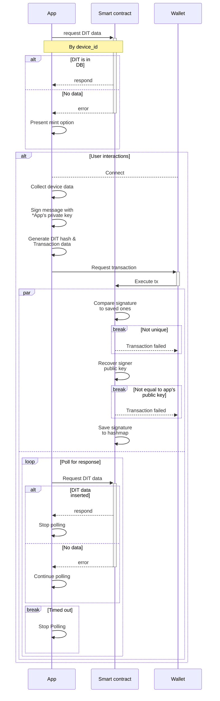
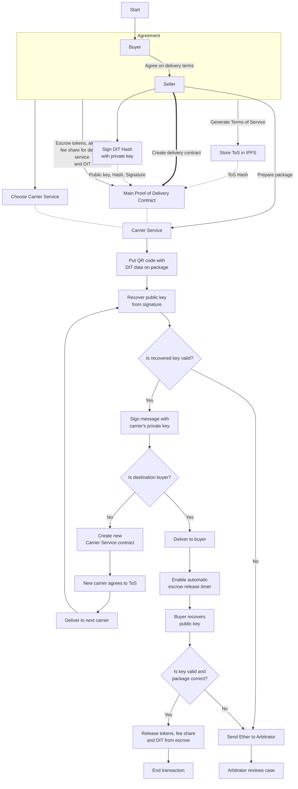

# Device Identity Token

The Device Identity Token (DIT) project uses blockchain technology to create unique, non-transferable tokens tied to individual physical devices. These tokens can be used as secure verification of device ownership, helping to prevent Sybil attacks. With extension to other usages as ensuring reliable transactions in device marketplaces, by extending the capabilities of Proof of Delivery (PoD) technology.

This project was done in April 2024 for Chainlink yearly hackathon

https://github.com/user-attachments/assets/79cba330-67e9-40b4-b080-1af552a63666

***

## Table of Contents

1.  [Key Features](#key-features)
2.  [Technical Implementation](#technical-implementation)
3.  [Use Cases](#use-cases)
4.  [Technologies Used](#technologies-used)
5.  [Getting Started](#getting-started)

## Key Features

-   Minting and management of unique, non-transferable tokens tied to physical device
-   Blockchain-based verification of device ownership
-   Potential integration with Proof of Delivery (PoD) systems

## Technical Implementation

### Smart Contract Interaction Flow

The core of the DIT system involves interactions between the app, wallet, and smart contracts. Here's a simplified flow:

```mermaid
sequenceDiagram
    participant App
    
    participant Smart contract
	participant Wallet
   
    
    App ->>+ Smart contract : request DIT data
	Note over App,Smart contract : By device_id

    alt DIT is in DB
	    Smart contract -->> App : respond
	    
	else No data
		Smart contract -->>- App : error
		App ->> App : Present mint option
	end

	alt	User interactions
		App --> Wallet : Connect
		
			App ->> App : Collect device data
			App ->> App : Sign message with <br>*App's private key
			App ->> App : Generate DIT hash & <br>Transaction data
			App ->>+ Wallet : Request transaction
			Wallet ->>- Smart contract : Execute tx

			
			par
				Smart contract ->> Smart contract : Compare signature <br>to saved ones
				break Not unique
					Smart contract -->> Wallet : Transaction failed
				end
				
				Smart contract ->> Smart contract : Recover signer <br>public key
				break Not equal to app's public key
					Smart contract -->> Wallet : Transaction failed
				end

				Smart contract ->> Smart contract : Save signature <br>to hashmap
			and
				loop Poll for response
					App ->>+ Smart contract : Request DIT data 
					

					alt DIT data inserted
						Smart contract -->> App : respond
						App ->> App : Stop polling
					else No data
						Smart contract -->>- App : error
						App ->> App : Continue polling
					end
					break Timed out
						App ->> App : Stop Polling
					end
				end
			end
	end
```

This ensures that each DIT is tied to a physical device and that all modifications are authenticated and traceable.

### Non-Transferability and Escrow

DITs are designed to be non-transferable, similar to Soulbound Tokens (SBTs), with important exception:

1.  **Wallet Binding**: Each DIT is bound to the wallet that minted it, representing device ownership.
2.  **Escrow Exception**: DITs can be temporarily transferred to an official escrow smart contract during transactions. This ensures secure handoffs while maintaining the integrity of ownership records.
3.  **New Wallet for Sales**: Before selling a device, the owner must mint a new DIT on a fresh, empty wallet (e.g., on the device itself). This practice prevents unintended access to the seller's personal wallet.

This approach ensures that DITs accurately represent current device ownership while enabling secure transactions.

### Integration with Proof of Delivery (PoD)

The DIT system enhances traditional PoD processes by incorporating device-specific verification:

```mermaid
flowchart TD
	subgraph Agreement["Agreement"]
	    S["Seller"]
	    B["Buyer"]
	end
	    Start["Start"] --> B
	    B -- Agree on delivery terms --> S
	    Agreement -- Generate Terms of Service --> IPFS["Store ToS in IPFS"]
	    IPFS -. ToS Hash .-> POD["Main Proof of Delivery Contract"]
	    Agreement -- Escrow tokens, alongside <br>fee share for delivery service <br>and DIT --> POD
	    S == Create delivery contract ==> POD
	    S -- Prepare package --> CS["Carrier Service"]
	    POD -.- CS
	    S --> SignDIT["Sign DIT Hash <br>with private key"]
	    SignDIT -. Public key, Hash, Signature .-> POD
	    Agreement --> ChooseCS["Choose Carrier Service"]
	    ChooseCS -.- CS
	    CS --> QR["Put QR code with <br>DIT data on package"]
	    QR --> RecoverKey["Recover public key <br>from signature"]
	    RecoverKey --> ValidateKey{"Is recovered key valid?"}
	    ValidateKey -- Yes --> SignMessage["Sign message with <br>carrier's private key"]
	    ValidateKey -- No --> Arbitration["Send Ether to Arbitrator"]
	    SignMessage --> Destination{"Is destination buyer?"}
	    Destination -- Yes --> Deliver["Deliver to buyer"]
	    Destination -- No --> CreateCSContract["Create new <br>Carrier Service contract"]
	    CreateCSContract --> NewCarrier["New carrier agrees to ToS"]
	    NewCarrier --> DeliverIntermediate["Deliver to next carrier"]
	    DeliverIntermediate --> RecoverKey
	    Deliver --> EnableEscrow["Enable automatic <br>escrow release timer"]
	    EnableEscrow --> BuyerVerify["Buyer recovers <br>public key"]
	    BuyerVerify --> FinalValidation{"Is key valid and <br>package correct?"}
	    FinalValidation -- Yes --> ReleaseEscrow["Release tokens, fee share <br>and DIT from escrow"]
	    FinalValidation -- No --> Arbitration
	    ReleaseEscrow --> End["End transaction"]
	    Arbitration --> ArbitratorReview["Arbitrator reviews case"]
```

This integration creates a tamper-evident chain of custody, enhancing trust and security in device transactions.

## Use Cases

1.  **Decentralized Marketplace Enhancement**
    -   Secure device ownership verification
    -   Tamper-evident delivery process
    -   Automated escrow release
2.  **Anti-Sybil Measures**
    -   Account creation verification
    -   Participation in token distributions
    -   Access control for web3 applications
3.  **Supply Chain Verification**
    -   Tracking device provenance
    -   Preventing counterfeit devices
    -   Streamlining warranty and repair processes
4.  **Secure Device Rentals**
    -   Temporary DIT transfers for rental periods
    -   Automated access control for rented devices
    -   Seamless return process at the end of rental periods
5.  **Server Access Management**
    -   DIT-based authentication for dedicated server access
    -   Time-limited access control for cloud resources
    -   Automatic revocation of access rights
6.  **Smart Mobility Solutions**
    -   DIT-enabled access for shared electric vehicles (cars, scooters, bikes)
    -   Usage tracking and billing based on DIT possession
    -   Enhanced security for vehicle sharing platforms
7.  **IoT Device Management**
    -   Secure ownership and control of smart home devices
    -   Streamlined transfer of IoT device ownership
    -   Integration with smart city infrastructure

## Technologies Used

Swift: 
- [web3.swift](https://github.com/argentlabs/web3.swift) (Swift interaction with Blockchain)
- [swiftabigen](https://github.com/imanrep/swiftabigen) (ABI to Swift functions generation)

Solidity:
- [Tableland](https://tableland.xyz/) (Decentralized cloud database)

## Getting Started
1. #### To begin, either
	 - Clone project in XCode: `Integrate` → `Clone` > Paste in (https://github.com/ZeroDelusions/Device-Identity-Token.git).

		**or**
	
	- Download zip directly from git page.

2. #### Deploy smart contracts

	Get Sepolia $ETH or any other chain base currency equivalent. 
	> Smart contract, firstly in development, were deployed on Polygon Mumbai, because of ease of getting test-net $MATIC, and low gas cots. But because of often chain instability, it disrupted work process. So later on, they were hosted on OP Sepolia network.
	---
	OP Sepolia faucets:
	- [Chainlink](https://faucets.chain.link/optimism-sepolia)
	- [Alchemy](https://sepoliafaucet.com/)
	- [Infura](https://www.infura.io/faucet/sepolia)
	- [QuickNode](https://faucet.quicknode.com/optimism/)
	- [Getblock](https://getblock.io/faucet/op-sepolia/)
	- [Bwarelabs](https://bwarelabs.com/faucets/optimism-sepolia)
	- [Farcaster](https://warpcast.com/haardikkk/0x28f4237d)
	- [LearnWeb3](https://learnweb3.io/faucets)
	- [ETH Global Testnet](https://ethglobal.com/faucet)
	- [Ethereum Ecosystem](https://www.ethereum-ecosystem.com/faucets)
	---
	
	For deployment could be used any ethereum development environment, like Hardhat, Foundry, Truffle, etc.
	
	We will use [Remix](https://remix.ethereum.org):

	1. Import `Smart contracts` folder from project repository.
	2. Go to `Solidity compiler`, make sure `Auto compile` is [✓].
	3. Go to `Deploy & run transactions`, choose your wallet as provider in Environment field at the top. Make sure to choose OP Sepolia network. If you don't have it, you can add it [here](https://chainlist.org/chain/11155420).
	4. Select `database.sol`.
	5. Go to `Deploy & run transactions`. Deploy.
	6. Select `dit.sol`. Copy address of deployed `database.sol`. Paste in field near Deploy button. Deploy.
	7. Paste `dit.sol` address to `addToAllowList` (database.sol) field and click the button.
	8. Go to [ETH vanity address generator](https://vanity-eth.tk/), or any other one. Paste wallet address in `setAppPublicKey` (dit.sol) field. Call the function.
	
	Setup Web3 IaaS provider. There are plenty. Alchemy, QuickNode, etc.
	I used [Infura](https://app.infura.io/). Register account. Create API key. Make sure to enable OP Sepolia in API endpoints.
	
	
	
4. #### Configure environmental variables

	In XCode project:
	
	`Product` → `Scheme` → `Edit scheme` > Run > Environment variables 
	
	| Name| Value |
	|--|--|
	| DIT_CONTRACT_ADDRESS | *Your `dit.sol` contract address* |
	| PROVIDER_KEY| *Infura key* |
	| APP_PRIVATE_KEY| *Generated private key* |

	**You are all set!** 
